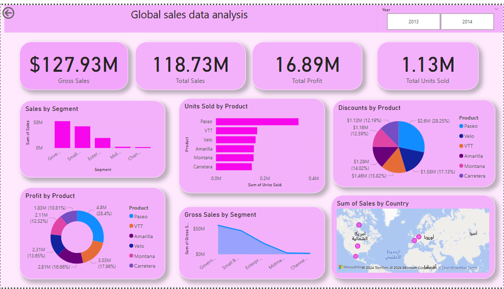

Global Sales Data Analysis Dashboard

Overview
This Power BI project provides a comprehensive analysis of global sales data for the years 2013 and 2014. The dashboard showcases key metrics and visualizations that help in understanding sales performance, profitability, and regional trends.

Features

Gross Sales: Total revenue generated before any deductions.
Total Sales: Net revenue after discounts and other deductions.
Total Profit: Overall profit earned across all segments and products.
Total Units Sold: The total quantity of products sold.

Key Insights:

Sales by Segment:
Analyzes sales performance across different market segments (e.g., Government, Small, Enterprise).
Units Sold by Product:
Highlights the top-performing products based on units sold.
Discounts by Product:
Displays the distribution of discounts offered on each product.
Profit by Product:
Provides insights into the profitability of each product category.
Sales by Country:
Geographical representation of sales performance globally.
Trend Analysis:
Examines sales trends over time for different segments.

